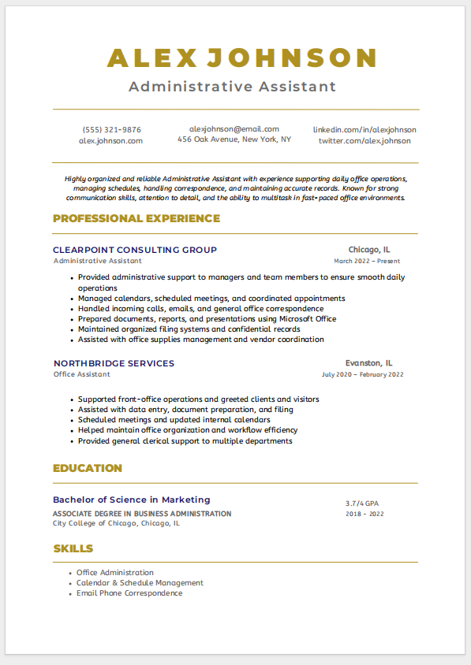
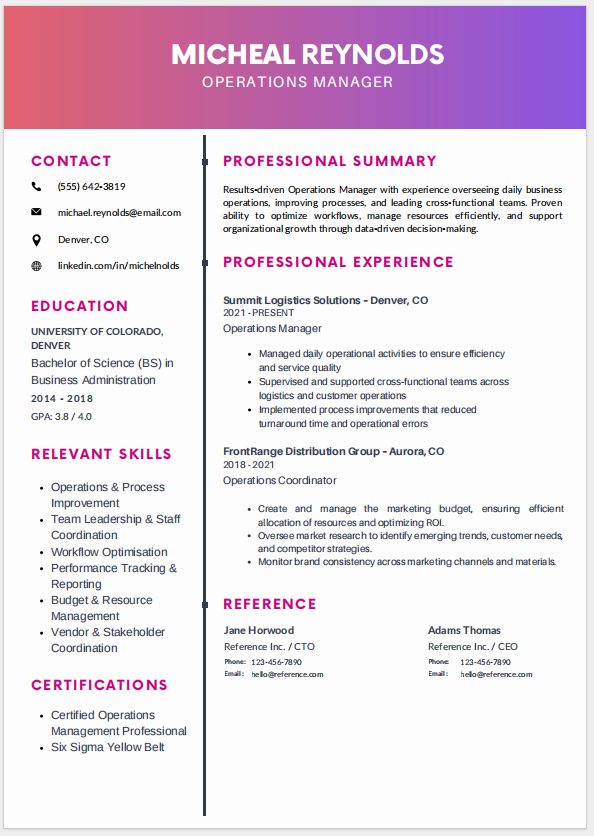
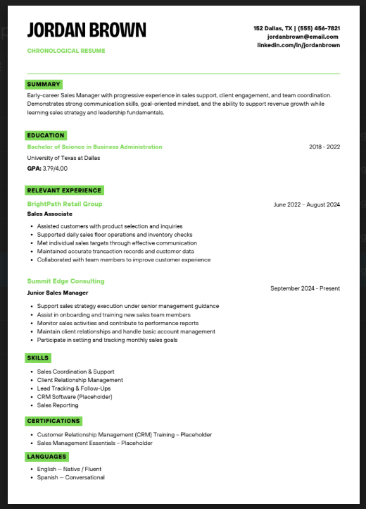
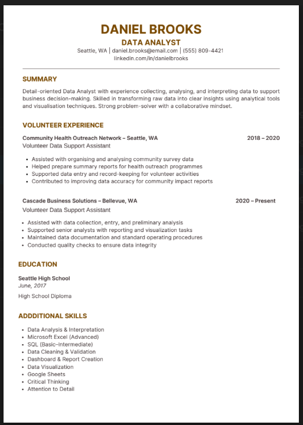
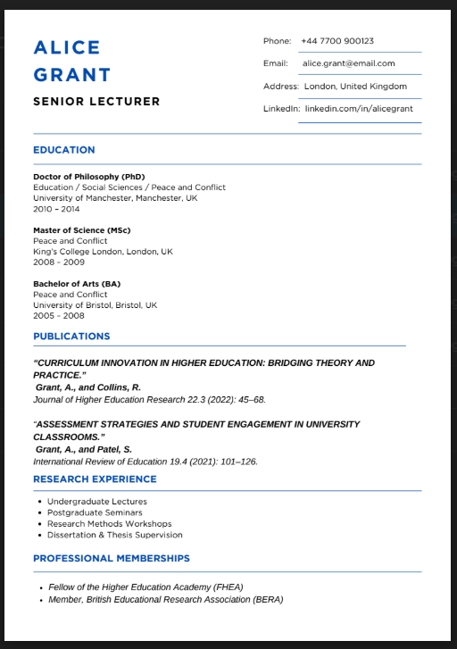

# ResumeForge

Build professional resumes with ease. ResumeForge is a modern, feature-rich resume builder built with Next.js 14, React, and TypeScript.

## Features

### Templates

- 6 templates: Professional, Executive, Chronological, Traditional, Academic, Creative
- Visual template selector with thumbnails
- Real-time preview while editing
- Template switching without losing data

### Resume Form

- Accordion-style sections for clean editing
- Add/remove entries for experience, education, skills, and more
- Drag-and-drop reordering for experience and education
- Bullet management for responsibilities and achievements

### Additional Sections

- Publications
- Research experience
- Professional memberships
- Languages (with fluency)
- References
- Certifications

### Data & Export

- Auto-save every 2 seconds
- Local storage persistence
- Manual save button
- PDF download (ATS-friendly, selectable text)
- Print-optimized layout

## Quick Start

### Prerequisites

- Node.js 18+
- npm or yarn

### Installation

1. Clone the repository

```bash
git clone https://github.com/ShemaiahYaba/ResumeForge.git
cd ResumeForge
```

1. Install dependencies

```bash
npm install
```

1. Run the dev server

```bash
npm run dev
```

1. Open in your browser

```markdown
http://localhost:3000
```

## Tech Stack

### Core

- Next.js 14 (App Router)
- React 18
- TypeScript

### Styling

- Tailwind CSS
- shadcn/ui

### PDF Generation

- @react-pdf/renderer

## Project Structure

```markdown
ResumeForge/
├── src/
│ ├── app/
│ │ ├── layout.tsx
│ │ ├── page.tsx
│ │ └── globals.css
│ ├── components/
│ │ ├── resume-form/
│ │ │ ├── personal-info-form.tsx
│ │ │ ├── experience-form.tsx
│ │ │ ├── education-form.tsx
│ │ │ ├── skills-form.tsx
│ │ │ ├── publications-form.tsx
│ │ │ ├── research-experience-form.tsx
│ │ │ ├── professional-memberships-form.tsx
│ │ │ ├── languages-form.tsx
│ │ │ ├── references-form.tsx
│ │ │ └── template-select-form.tsx
│ │ ├── templates/
│ │ │ ├── professional-template.tsx
│ │ │ ├── executive-template.tsx
│ │ │ ├── chronological-template.tsx
│ │ │ ├── traditional-template.tsx
│ │ │ ├── academic-template.tsx
│ │ │ └── creative-template.tsx
│ │ ├── pdf-templates/
│ │ │ ├── professional-pdf-template.tsx
│ │ │ ├── executive-pdf-template.tsx
│ │ │ ├── chronological-pdf-template.tsx
│ │ │ ├── traditional-pdf-template.tsx
│ │ │ ├── academic-pdf-template.tsx
│ │ │ └── creative-pdf-template.tsx
│ │ ├── ui/
│ │ ├── resume-form.tsx
│ │ └── resume-preview.tsx
│ ├── lib/
│ │ ├── types.ts
│ │ ├── data.ts
│ │ ├── pdf-generator.tsx
│ │ └── placeholder-images.json
│ └── hooks/
│ └── use-toast.ts
├── public/
│ └── assets/
│ └── img/
│ ├── professional.png
│ ├── executive.png
│ ├── chronological.png
│ ├── traditional.png
│ ├── academic.png
│ └── creative.png
├── package.json
└── README.md
```

## Available Templates

### Professional



- Clean gold-accent layout
- Strong for general professional roles

### Executive



- Bold header and two-column structure
- Strong for management and senior roles

### Chronological



- Timeline-forward layout
- Strong for career progression clarity

### Traditional



- Classic single-column feel
- Strong for conservative industries

### Academic



- Publications and research-friendly
- Strong for academic CVs

### Creative


- Split layout with visual emphasis
- Strong for design and creative roles

## Usage Guide

1. Fill in your information

- Personal info, experience, education, and skills
- Add publications, research, languages, references, and more as needed

1. Choose a template

- Open the Template section
- Click any template to preview instantly

1. Export

- Download PDF
- Print directly from the browser

## Customization

Templates live in:

- Web preview: `src/components/templates/`
- PDF export: `src/components/pdf-templates/`

To add a new template:

1. Create the web template in `src/components/templates/`
2. Create the PDF version in `src/components/pdf-templates/`
3. Add it to `Template` in `src/lib/types.ts`
4. Wire it into `src/components/resume-preview.tsx`
5. Add it to `src/components/resume-form/template-select-form.tsx`
6. Register it in `src/lib/pdf-generator.tsx`
7. Add a thumbnail to `public/assets/img/`

## Deployment

### Vercel (recommended)

1. Push to GitHub
2. Import the repo in Vercel
3. Deploy

## Contributing

1. Fork the repository
2. Create a feature branch (`git checkout -b feature/AmazingFeature`)
3. Commit changes (`git commit -m "Add some AmazingFeature"`)
4. Push to the branch (`git push origin feature/AmazingFeature`)
5. Open a Pull Request

## License

MIT License. See `LICENSE` for details.

## Contact

- GitHub: <https://github.com/ShemaiahYaba>
- Project: <https://github.com/ShemaiahYaba/ResumeForge>
